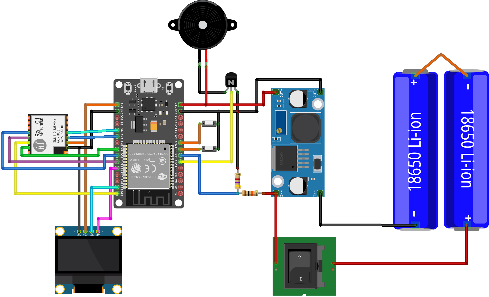

# LoRa Based Flood Response System


A decentralized emergency communication and flood response system built using **ESP32**, **LoRa**, GPS, and an interactive monitoring dashboard.
The system enables homes and rescue teams to communicate even when traditional cellular networks fail during flood disasters.

Residents can request:

* 🚑 Rescue assistance
* 🍞 Food & supply support

through a long-range LoRa network, while authorities can monitor requests and flood warnings from a live dashboard.

---

# 🌊 Project Overview

During severe floods and natural disasters, cellular infrastructure often becomes unreliable or completely unavailable.
This project creates a **local emergency communication network** using LoRa technology for disaster response scenarios.

The system consists of:

* 🏠 Home Emergency Devices
* ⚠ Flood Warning Nodes
* 🖥 Central Monitoring Dashboard
* 📡 LoRa Communication Network

All devices communicate through LoRa without needing internet or mobile networks.

---

# ✨ Features

## 🚨 Emergency Request System

Residents can send:

* Rescue requests
* Food/supply requests

through a single button press.

---

## ⚠ Flood Early Warning System

Dedicated flood monitoring nodes detect dangerous water levels and broadcast warning alerts to all connected systems.

---

## 📍 Live Location Tracking

Each request contains GPS coordinates allowing rescue teams to locate victims directly from the dashboard.

---

## 🗺 Interactive Dashboard

The web dashboard provides:

* Live request notifications
* GPS mapping
* Rescue/supply markers
* Serial debug terminal
* Flood warning alerts
* Real-time monitoring

---

## 📡 LoRa Communication

* Long-range communication
* Low power operation
* Works without cellular infrastructure
* Suitable for disaster zones

---

# 🛠 Hardware Used

## 🏠 Home Device

* ESP32
* LoRa Module (Ra-01 / SX1278)
* OLED Display
* Push Buttons
* GPS Module
* Buzzer
* Battery System

---

## ⚠ Warning Device

* ESP32
* Water level sensor
* LoRa Module
* Alarm/Buzzer

---

## 🖥 Ground Station

* ESP32
* LoRa Module
* USB Serial Communication

---

# 💻 Software Components

| File                    | Description                      |
| ----------------------- | -------------------------------- |
| `Home_Device.ino`       | Firmware for victim/home device  |
| `Warning_Device.ino`    | Flood monitoring node            |
| `Ground_Station(1).ino` | Central LoRa receiver            |
| `preview (3).html`      | Interactive monitoring dashboard |
| `Circuit Diagram.fzz`   | Fritzing design file             |

---

# 🔌 Circuit Diagram

## System Wiring



The hardware integrates:

* ESP32
* LoRa RA-01 module
* OLED display
* GPS communication
* Battery power management
* Warning buzzer

---

# 🖥 Dashboard Preview

The dashboard includes:

* Real-time flood alerts
* Rescue requests
* Supply requests
* Live GPS map
* Notification cards
* Debug terminal

The dashboard is built using:

* HTML
* CSS
* JavaScript
* Leaflet.js
* Web Serial API
* OpenStreetMap

Example dashboard implementation includes map rendering and notification management. 

---

# 🗺 Live GPS Mapping

Requests are automatically displayed on the map with different markers:

* 🔴 Red Marker → Rescue Request
* 🔵 Blue Marker → Supply Request

The system automatically focuses the map on incoming requests.

Example marker management logic is implemented in the dashboard. 

---

# 📡 Communication Protocol

Example JSON message format:

```json id="0n0d2w"
{
  "id": "HOUSE_01",
  "type": "Rescue",
  "lat": 23.7801,
  "lon": 90.4072
}
```

Flood warning message:

```json id="4ndh80"
{
  "type": "warn"
}
```

---

# 🚀 How To Run

## 1️⃣ Upload Firmware

Upload the corresponding `.ino` files to each ESP32 device:

* Home device
* Warning node
* Ground station

Using:

* Arduino IDE
* PlatformIO

---

## 2️⃣ Open Dashboard

Open:

```text id="5pmf3k"
preview (3).html
```

using a Chromium-based browser:

* Google Chrome
* Microsoft Edge

---

## 3️⃣ Connect Serial

* Click `Connect`
* Select the ESP32 Ground Station COM port
* Start monitoring incoming emergency requests

---

# 🧠 System Architecture

```text id="u4r6o6"
HOME DEVICE ---> LoRa ---> GROUND STATION ---> WEB DASHBOARD

WARNING NODE ---> LoRa ---> GROUND STATION ---> ALERT SYSTEM
```

---

# 📷 Recommended Repository Images

Recommended images for GitHub repository:

```text id="bmqngk"
images/
├── flood_response_banner.png
├── circuit_diagram.png
├── dashboard_preview.png
├── home_device.jpg
├── warning_node.jpg
└── field_testing.jpg
```

---

# 🔮 Future Improvements

* Mesh LoRa networking
* Solar-powered field nodes
* SMS gateway integration
* AI-based flood prediction
* Offline cached maps
* Mobile application
* Voice alert broadcasting
* AES encrypted communication

---

# ⚠ Disclaimer

This project is intended for:

* Educational purposes
* Disaster preparedness research
* Emergency communication systems
* IoT experimentation

Always comply with local radio communication regulations.

---

# 👨‍💻 Author

Developed by **Fazle Elahi Tonmoy**

Interests:

* Embedded Systems
* Disaster Technology
* Robotics
* UAV Systems
* Emergency Communication Networks

---

# 📄 License

This project is licensed under the MIT License.

```text id="2ccij2"
MIT License © 2026 Fazle Elahi Tonmoy
```

